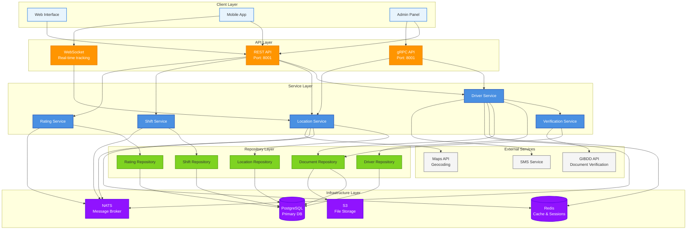
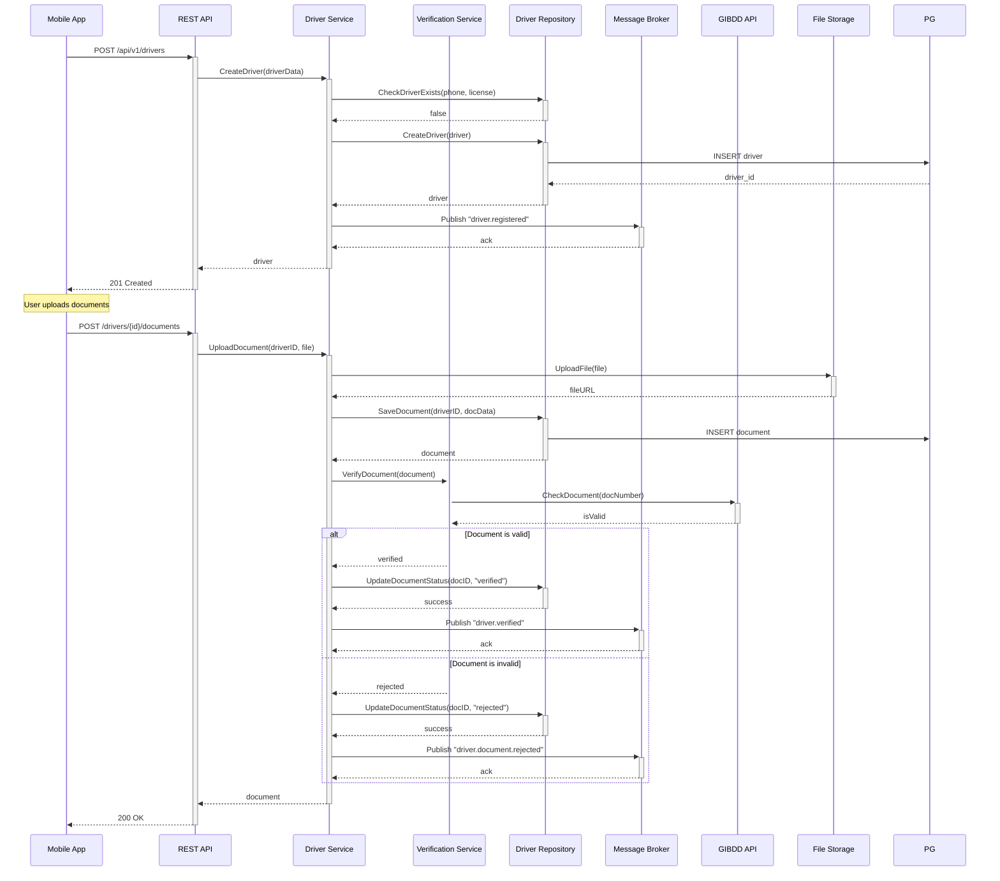
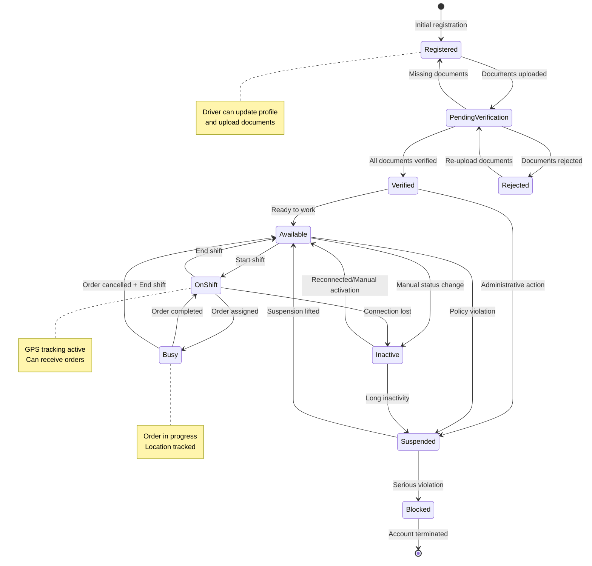
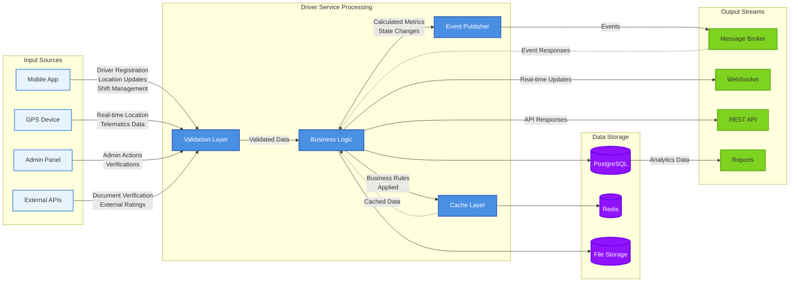
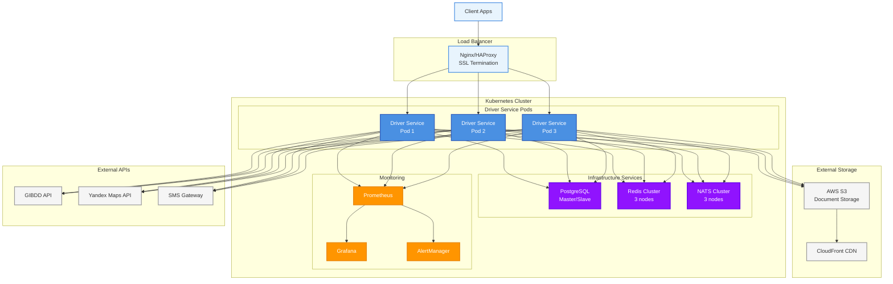

# Driver Service - UML Диаграммы архитектуры

## Диаграмма компонентов сервиса



## Диаграмма последовательности регистрации водителя



## Диаграмма состояний водителя



## Диаграмма классов основных сущностей

```mermaid
classDiagram
    class Driver {
        +UUID id
        +String phone
        +String email
        +String firstName
        +String lastName
        +String middleName
        +Date birthDate
        +String passportSeries
        +String passportNumber
        +String licenseNumber
        +Date licenseExpiry
        +Status status
        +Float currentRating
        +Int totalTrips
        +Metadata metadata
        +DateTime createdAt
        +DateTime updatedAt
        +DateTime deletedAt
        
        +isActive() Bool
        +canReceiveOrders() Bool
        +updateRating(newRating Float)
        +incrementTripCount()
    }
    
    class DriverDocument {
        +UUID id
        +UUID driverId
        +DocumentType type
        +String documentNumber
        +Date issueDate
        +Date expiryDate
        +String fileURL
        +VerificationStatus status
        +String verifiedBy
        +DateTime verifiedAt
        +Metadata metadata
        
        +isExpired() Bool
        +isVerified() Bool
        +verify(verifierID String)
        +reject(reason String)
    }
    
    class DriverLocation {
        +UUID id
        +UUID driverId
        +Float latitude
        +Float longitude
        +Float altitude
        +Float accuracy
        +Float speed
        +Float bearing
        +String address
        +DateTime recordedAt
        
        +distanceTo(other DriverLocation) Float
        +isValidLocation() Bool
        +reverseGeocode() String
    }
    
    class DriverShift {
        +UUID id
        +UUID driverId
        +UUID vehicleId
        +DateTime startTime
        +DateTime endTime
        +ShiftStatus status
        +Location startLocation
        +Location endLocation
        +Int totalTrips
        +Float totalDistance
        +Float totalEarnings
        
        +getDuration() Duration
        +isActive() Bool
        +end(location DriverLocation)
        +addTrip(distance Float, earnings Float)
    }
    
    class DriverRating {
        +UUID id
        +UUID driverId
        +UUID orderId
        +UUID customerId
        +Int rating
        +String comment
        +RatingType type
        +Map criteriaScores
        +Bool isVerified
        
        +isValid() Bool
        +getOverallScore() Float
    }
    
    class RatingStats {
        +UUID driverId
        +Float averageRating
        +Int totalRatings
        +Map criteriaAverages
        +DateTime lastUpdated
        
        +calculate(ratings []DriverRating)
        +updateAverage(newRating Int)
    }
    
    %% Relationships
    Driver ||--o{ DriverDocument : has
    Driver ||--o{ DriverLocation : tracks
    Driver ||--o{ DriverShift : works
    Driver ||--o{ DriverRating : receives
    Driver ||--|| RatingStats : has
    
    DriverShift ||--o{ DriverLocation : contains
    DriverRating }o--|| DriverShift : belongs_to
```

## Диаграмма потоков данных



## Диаграмма развертывания



<<<<<<< HEAD
Эти UML диаграммы показывают полную архитектуру Driver Service, включая компоненты, потоки данных, состояния и развертывание в production среде.
=======
Эти UML диаграммы показывают полную архитектуру Driver Service, включая компоненты, потоки данных, состояния и развертывание в production среде.
>>>>>>> ac8533d8e091c50114bff809a58122508470f0f1
