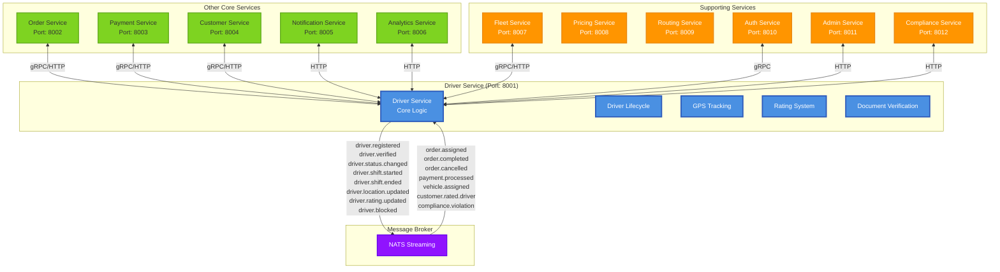

# Driver Service - Интерфейсы взаимодействия

## Схема взаимодействия сервисов



## NATS События (Исходящие)

### 1. Жизненный цикл водителя

```go
// driver.registered - Новый водитель зарегистрирован
type DriverRegisteredEvent struct {
    EventType   string    `json:"event_type"`
    DriverID    string    `json:"driver_id"`
    Phone       string    `json:"phone"`
    Email       string    `json:"email"`
    Name        string    `json:"name"`
    LicenseNumber string  `json:"license_number"`
    VehicleCapacity int   `json:"vehicle_capacity,omitempty"`
    City        string    `json:"city"`
    Timestamp   time.Time `json:"timestamp"`
    Metadata    map[string]interface{} `json:"metadata,omitempty"`
}
// Subject: "driver.registered"
// Consumers: Order Service, Analytics Service, Notification Service

// driver.verified - Документы водителя верифицированы
type DriverVerifiedEvent struct {
    EventType      string    `json:"event_type"`
    DriverID       string    `json:"driver_id"`
    VerifiedBy     string    `json:"verified_by"`
    DocumentTypes  []string  `json:"document_types"`
    LicenseExpiry  time.Time `json:"license_expiry"`
    Timestamp      time.Time `json:"timestamp"`
    Metadata       map[string]interface{} `json:"metadata,omitempty"`
}
// Subject: "driver.verified"
// Consumers: Order Service, Fleet Service, Compliance Service
```

### 2. Статус и доступность

```go
// driver.status.changed - Изменение статуса водителя
type DriverStatusChangedEvent struct {
    EventType   string    `json:"event_type"`
    DriverID    string    `json:"driver_id"`
    OldStatus   string    `json:"old_status"`
    NewStatus   string    `json:"new_status"`
    Reason      string    `json:"reason,omitempty"`
    ChangedBy   string    `json:"changed_by"`
    Timestamp   time.Time `json:"timestamp"`
    Metadata    map[string]interface{} `json:"metadata,omitempty"`
}
// Subject: "driver.status.changed"
// Consumers: Order Service, Analytics Service, Admin Service

// driver.availability.changed - Изменение доступности водителя
type DriverAvailabilityChangedEvent struct {
    EventType     string    `json:"event_type"`
    DriverID      string    `json:"driver_id"`
    IsAvailable   bool      `json:"is_available"`
    Location      Location  `json:"location,omitempty"`
    VehicleID     string    `json:"vehicle_id,omitempty"`
    Timestamp     time.Time `json:"timestamp"`
    Metadata      map[string]interface{} `json:"metadata,omitempty"`
}
// Subject: "driver.availability.changed"
// Consumers: Order Service, Routing Service
```

### 3. Смены водителей

```go
// driver.shift.started - Начало смены
type DriverShiftStartedEvent struct {
    EventType   string    `json:"event_type"`
    DriverID    string    `json:"driver_id"`
    ShiftID     string    `json:"shift_id"`
    VehicleID   string    `json:"vehicle_id,omitempty"`
    StartTime   time.Time `json:"start_time"`
    Location    Location  `json:"location"`
    Timestamp   time.Time `json:"timestamp"`
    Metadata    map[string]interface{} `json:"metadata,omitempty"`
}
// Subject: "driver.shift.started"
// Consumers: Fleet Service, Analytics Service, Order Service

// driver.shift.ended - Окончание смены
type DriverShiftEndedEvent struct {
    EventType      string    `json:"event_type"`
    DriverID       string    `json:"driver_id"`
    ShiftID        string    `json:"shift_id"`
    EndTime        time.Time `json:"end_time"`
    Duration       int64     `json:"duration_minutes"`
    TotalTrips     int       `json:"total_trips"`
    TotalDistance  float64   `json:"total_distance_km"`
    TotalEarnings  float64   `json:"total_earnings"`
    FuelConsumed   float64   `json:"fuel_consumed,omitempty"`
    Timestamp      time.Time `json:"timestamp"`
    Metadata       map[string]interface{} `json:"metadata,omitempty"`
}
// Subject: "driver.shift.ended"
// Consumers: Fleet Service, Payment Service, Analytics Service
```

### 4. GPS и местоположение

```go
// driver.location.updated - Обновление местоположения
type DriverLocationUpdatedEvent struct {
    EventType   string    `json:"event_type"`
    DriverID    string    `json:"driver_id"`
    Location    Location  `json:"location"`
    Speed       float64   `json:"speed_kmh"`
    Bearing     float64   `json:"bearing_degrees"`
    Accuracy    float64   `json:"accuracy_meters"`
    OnTrip      bool      `json:"on_trip"`
    OrderID     string    `json:"order_id,omitempty"`
    Timestamp   time.Time `json:"timestamp"`
    Metadata    map[string]interface{} `json:"metadata,omitempty"`
}

type Location struct {
    Latitude  float64 `json:"latitude"`
    Longitude float64 `json:"longitude"`
    Address   string  `json:"address,omitempty"`
}
// Subject: "driver.location.updated"
// Consumers: Order Service, Routing Service, Analytics Service, Fleet Service
```

### 5. Рейтинги и производительность

```go
// driver.rating.updated - Обновление рейтинга
type DriverRatingUpdatedEvent struct {
    EventType      string    `json:"event_type"`
    DriverID       string    `json:"driver_id"`
    NewRating      float64   `json:"new_rating"`
    PreviousRating float64   `json:"previous_rating"`
    TotalRatings   int       `json:"total_ratings"`
    LastOrderID    string    `json:"last_order_id"`
    Timestamp      time.Time `json:"timestamp"`
    Metadata       map[string]interface{} `json:"metadata,omitempty"`
}
// Subject: "driver.rating.updated"
// Consumers: Order Service, Analytics Service, Notification Service

// driver.performance.alert - Предупреждение о производительности
type DriverPerformanceAlertEvent struct {
    EventType   string    `json:"event_type"`
    DriverID    string    `json:"driver_id"`
    AlertType   string    `json:"alert_type"` // "low_rating", "excessive_cancellations", "speeding"
    Severity    string    `json:"severity"`   // "warning", "critical"
    Details     string    `json:"details"`
    Value       float64   `json:"value"`
    Threshold   float64   `json:"threshold"`
    Timestamp   time.Time `json:"timestamp"`
    Metadata    map[string]interface{} `json:"metadata,omitempty"`
}
// Subject: "driver.performance.alert"
// Consumers: Admin Service, Notification Service
```

## NATS События (Входящие)

### 1. Заказы и поездки

```go
// order.assigned - Заказ назначен водителю
type OrderAssignedEvent struct {
    EventType        string    `json:"event_type"`
    OrderID          string    `json:"order_id"`
    DriverID         string    `json:"driver_id"`
    CustomerID       string    `json:"customer_id"`
    PickupLocation   Location  `json:"pickup_location"`
    DropoffLocation  Location  `json:"dropoff_location"`
    EstimatedFare    float64   `json:"estimated_fare"`
    EstimatedDistance float64  `json:"estimated_distance_km"`
    EstimatedDuration int      `json:"estimated_duration_minutes"`
    Priority         int       `json:"priority"`
    Timestamp        time.Time `json:"timestamp"`
}
// Subject: "order.assigned"
// Action: Update driver status to "busy", start tracking order

// order.completed - Заказ завершен
type OrderCompletedEvent struct {
    EventType     string    `json:"event_type"`
    OrderID       string    `json:"order_id"`
    DriverID      string    `json:"driver_id"`
    CustomerID    string    `json:"customer_id"`
    ActualFare    float64   `json:"actual_fare"`
    ActualDistance float64  `json:"actual_distance_km"`
    Duration      int       `json:"duration_minutes"`
    Rating        int       `json:"rating,omitempty"`
    Tips          float64   `json:"tips,omitempty"`
    Timestamp     time.Time `json:"timestamp"`
}
// Subject: "order.completed"
// Action: Update driver status to "available", record trip stats

// order.cancelled - Заказ отменен
type OrderCancelledEvent struct {
    EventType     string    `json:"event_type"`
    OrderID       string    `json:"order_id"`
    DriverID      string    `json:"driver_id,omitempty"`
    CustomerID    string    `json:"customer_id"`
    CancelReason  string    `json:"cancel_reason"`
    CancelledBy   string    `json:"cancelled_by"` // "driver", "customer", "system"
    Compensation  float64   `json:"compensation,omitempty"`
    Timestamp     time.Time `json:"timestamp"`
}
// Subject: "order.cancelled"
// Action: Update driver status, apply cancellation policies
```

### 2. Платежи и финансы

```go
// payment.processed - Платеж обработан
type PaymentProcessedEvent struct {
    EventType    string    `json:"event_type"`
    PaymentID    string    `json:"payment_id"`
    OrderID      string    `json:"order_id"`
    DriverID     string    `json:"driver_id"`
    Amount       float64   `json:"amount"`
    Commission   float64   `json:"commission"`
    NetAmount    float64   `json:"net_amount"`
    PaymentMethod string   `json:"payment_method"`
    Status       string    `json:"status"`
    Timestamp    time.Time `json:"timestamp"`
}
// Subject: "payment.processed"
// Action: Update driver earnings, trigger instant payout if eligible

// payment.failed - Платеж не прошел
type PaymentFailedEvent struct {
    EventType   string    `json:"event_type"`
    PaymentID   string    `json:"payment_id"`
    OrderID     string    `json:"order_id"`
    DriverID    string    `json:"driver_id"`
    Amount      float64   `json:"amount"`
    FailReason  string    `json:"fail_reason"`
    RetryCount  int       `json:"retry_count"`
    Timestamp   time.Time `json:"timestamp"`
}
// Subject: "payment.failed"
// Action: Handle payment failure, notify driver
```

### 3. Автопарк и транспорт

```go
// vehicle.assigned - Транспорт назначен водителю
type VehicleAssignedEvent struct {
    EventType     string    `json:"event_type"`
    VehicleID     string    `json:"vehicle_id"`
    DriverID      string    `json:"driver_id"`
    VehicleType   string    `json:"vehicle_type"`
    LicensePlate  string    `json:"license_plate"`
    AssignedBy    string    `json:"assigned_by"`
    RentalRate    float64   `json:"rental_rate,omitempty"`
    Timestamp     time.Time `json:"timestamp"`
}
// Subject: "vehicle.assigned"
// Action: Update driver profile with vehicle info

// vehicle.maintenance.required - Требуется техобслуживание
type VehicleMaintenanceRequiredEvent struct {
    EventType      string    `json:"event_type"`
    VehicleID      string    `json:"vehicle_id"`
    DriverID       string    `json:"driver_id"`
    MaintenanceType string   `json:"maintenance_type"`
    Urgency        string    `json:"urgency"` // "low", "medium", "high", "critical"
    Description    string    `json:"description"`
    EstimatedCost  float64   `json:"estimated_cost,omitempty"`
    Timestamp      time.Time `json:"timestamp"`
}
// Subject: "vehicle.maintenance.required"
// Action: Block driver if critical, schedule maintenance
```

### 4. Оценки клиентов

```go
// customer.rated.driver - Клиент оценил водителя
type CustomerRatedDriverEvent struct {
    EventType     string            `json:"event_type"`
    RatingID      string            `json:"rating_id"`
    OrderID       string            `json:"order_id"`
    DriverID      string            `json:"driver_id"`
    CustomerID    string            `json:"customer_id"`
    Rating        int               `json:"rating"`        // 1-5
    Comment       string            `json:"comment,omitempty"`
    Criteria      map[string]int    `json:"criteria,omitempty"` // "cleanliness": 5, "driving": 4
    Anonymous     bool              `json:"anonymous"`
    Timestamp     time.Time         `json:"timestamp"`
}
// Subject: "customer.rated.driver"
// Action: Update driver rating, trigger rating recalculation
```

## HTTP/gRPC API Интерфейсы

### 1. Order Service Integration

```go
// gRPC методы для Order Service
service OrderServiceClient {
    // Получение информации о заказе
    rpc GetOrder(GetOrderRequest) returns (OrderResponse);
    
    // Обновление статуса водителя в заказе
    rpc UpdateDriverStatus(UpdateDriverStatusRequest) returns (Empty);
    
    // Получение активных заказов водителя
    rpc GetActiveOrders(GetActiveOrdersRequest) returns (OrderListResponse);
}

type UpdateDriverStatusRequest struct {
    string order_id = 1;
    string driver_id = 2;
    string status = 3;    // "accepted", "arrived", "started", "completed"
    Location location = 4;
    int64 timestamp = 5;
}
```

### 2. Payment Service Integration

```go
// HTTP REST API для Payment Service
// GET /api/v1/drivers/{driver_id}/balance
type DriverBalanceResponse struct {
    DriverID        string  `json:"driver_id"`
    CurrentBalance  float64 `json:"current_balance"`
    PendingEarnings float64 `json:"pending_earnings"`
    WithdrawnAmount float64 `json:"withdrawn_amount"`
    Currency        string  `json:"currency"`
    LastUpdated     time.Time `json:"last_updated"`
}

// POST /api/v1/drivers/{driver_id}/instant-payout
type InstantPayoutRequest struct {
    Amount        float64 `json:"amount"`
    PaymentMethod string  `json:"payment_method"`
    AccountInfo   map[string]string `json:"account_info"`
}
```

### 3. Fleet Service Integration

```go
// gRPC методы для Fleet Service
service FleetServiceClient {
    // Получение информации о транспорте
    rpc GetVehicle(GetVehicleRequest) returns (VehicleResponse);
    
    // Обновление одометра
    rpc UpdateOdometer(UpdateOdometerRequest) returns (Empty);
    
    // Отчет о повреждениях
    rpc ReportDamage(ReportDamageRequest) returns (DamageReportResponse);
}

type UpdateOdometerRequest struct {
    string vehicle_id = 1;
    string driver_id = 2;
    int64 odometer_reading = 3;
    Location location = 4;
    int64 timestamp = 5;
}
```

### 4. Authentication Service Integration

```go
// gRPC методы для Auth Service
service AuthServiceClient {
    // Валидация токена
    rpc ValidateToken(ValidateTokenRequest) returns (TokenValidationResponse);
    
    // Получение разрешений пользователя
    rpc GetUserPermissions(GetUserPermissionsRequest) returns (UserPermissionsResponse);
    
    // Обновление профиля безопасности
    rpc UpdateSecurityProfile(UpdateSecurityProfileRequest) returns (Empty);
}

type TokenValidationResponse struct {
    bool valid = 1;
    string user_id = 2;
    string user_type = 3;
    repeated string permissions = 4;
    int64 expires_at = 5;
}
```

## WebSocket соединения

### Real-time GPS Tracking

```go
// WebSocket endpoint: ws://driver-service:8001/ws/tracking/{driver_id}
type LocationUpdateMessage struct {
    Type      string    `json:"type"`      // "location_update"
    DriverID  string    `json:"driver_id"`
    Location  Location  `json:"location"`
    Speed     float64   `json:"speed"`
    Bearing   float64   `json:"bearing"`
    Timestamp time.Time `json:"timestamp"`
}

// WebSocket endpoint: ws://driver-service:8001/ws/orders/{driver_id}
type OrderNotificationMessage struct {
    Type     string      `json:"type"`  // "order_assigned", "order_cancelled"
    OrderID  string      `json:"order_id"`
    DriverID string      `json:"driver_id"`
    Data     interface{} `json:"data"`
    Timestamp time.Time  `json:"timestamp"`
}
```

## Обработчики событий

### Event Handler Implementation

```go
// NATS Event Handlers
type EventHandlers struct {
    driverService   *DriverService
    locationService *LocationService
    shiftService    *ShiftService
    ratingService   *RatingService
}

func (h *EventHandlers) HandleOrderAssigned(msg *nats.Msg) {
    var event OrderAssignedEvent
    if err := json.Unmarshal(msg.Data, &event); err != nil {
        log.Error("Failed to unmarshal order assigned event", err)
        return
    }
    
    // Update driver status
    ctx := context.Background()
    if err := h.driverService.UpdateDriverStatus(ctx, event.DriverID, "busy"); err != nil {
        log.Error("Failed to update driver status", err)
        msg.Nak() // Negative acknowledgment for retry
        return
    }
    
    // Start tracking order
    if err := h.locationService.StartOrderTracking(ctx, event.DriverID, event.OrderID); err != nil {
        log.Error("Failed to start order tracking", err)
    }
    
    msg.Ack() // Acknowledge successful processing
}

func (h *EventHandlers) HandleOrderCompleted(msg *nats.Msg) {
    var event OrderCompletedEvent
    if err := json.Unmarshal(msg.Data, &event); err != nil {
        log.Error("Failed to unmarshal order completed event", err)
        return
    }
    
    ctx := context.Background()
    
    // Update driver status back to available
    if err := h.driverService.UpdateDriverStatus(ctx, event.DriverID, "available"); err != nil {
        log.Error("Failed to update driver status", err)
        msg.Nak()
        return
    }
    
    // Update shift statistics
    if err := h.shiftService.UpdateShiftStats(ctx, event.DriverID, event.ActualDistance, event.ActualFare); err != nil {
        log.Error("Failed to update shift stats", err)
    }
    
    // Stop order tracking
    if err := h.locationService.StopOrderTracking(ctx, event.DriverID, event.OrderID); err != nil {
        log.Error("Failed to stop order tracking", err)
    }
    
    msg.Ack()
}

func (h *EventHandlers) HandleCustomerRatedDriver(msg *nats.Msg) {
    var event CustomerRatedDriverEvent
    if err := json.Unmarshal(msg.Data, &event); err != nil {
        log.Error("Failed to unmarshal customer rating event", err)
        return
    }
    
    ctx := context.Background()
    
    // Add rating to driver
    rating := &DriverRating{
        ID:         uuid.New(),
        DriverID:   uuid.MustParse(event.DriverID),
        OrderID:    uuid.MustParse(event.OrderID),
        CustomerID: uuid.MustParse(event.CustomerID),
        Rating:     event.Rating,
        Comment:    &event.Comment,
        CreatedAt:  time.Now(),
    }
    
    if err := h.ratingService.AddRating(ctx, rating); err != nil {
        log.Error("Failed to add rating", err)
        msg.Nak()
        return
    }
    
    // Update driver's overall rating
    if err := h.ratingService.UpdateDriverRating(ctx, event.DriverID); err != nil {
        log.Error("Failed to update driver rating", err)
    }
    
    msg.Ack()
}
```

Эти интерфейсы обеспечивают полную интеграцию Driver Service с остальной экосистемой микросервисов, включая асинхронное взаимодействие через NATS и синхронные вызовы через HTTP/gRPC API.

