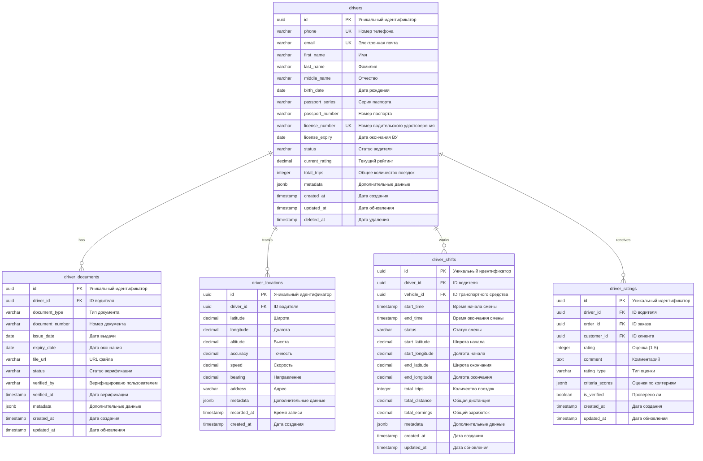

# Driver Service - Техническое описание

## Обзор сервиса

Driver Service является центральным компонентом микросервисной архитектуры CRM системы для таксопарков, отвечающим за полный жизненный цикл управления водителями. Сервис обрабатывает регистрацию, верификацию документов, GPS-трекинг в реальном времени и систему рейтингов водителей.

### Ключевые характеристики:
- **Порт**: 8001
- **Язык разработки**: Go (Golang)
- **База данных**: PostgreSQL
- **Message Broker**: NATS
- **Архитектура**: Domain Driven Design (DDD)
- **API**: RESTful HTTP API + gRPC

## Функциональные возможности

### 1. Управление профилями водителей
- Регистрация новых водителей
- Обновление персональной информации
- Управление статусами водителей
- Деактивация/блокировка аккаунтов

### 2. Верификация документов
- Загрузка и проверка водительских удостоверений
- Верификация медицинских справок
- Проверка документов на транспортное средство
- Интеграция с внешними API для проверки действительности документов

### 3. GPS-трекинг и мониторинг
- Отслеживание местоположения в реальном времени
- Мониторинг рабочих смен
- Анализ маршрутов и стиля вождения
- Детекция аномалий в поведении

### 4. Система рейтингов и отзывов
- Агрегация оценок от пассажиров
- Расчет рейтингов на основе различных метрик
- Система поощрений и штрафов
- Аналитика производительности водителя

## Архитектура базы данных

### Схема данных (UML)



### Индексы базы данных

```sql
-- Основные индексы для производительности
CREATE INDEX idx_drivers_phone ON drivers(phone);
CREATE INDEX idx_drivers_email ON drivers(email);
CREATE INDEX idx_drivers_license ON drivers(license_number);
CREATE INDEX idx_drivers_status ON drivers(status);
CREATE INDEX idx_drivers_rating ON drivers(current_rating);

-- Индексы для документов
CREATE INDEX idx_driver_documents_driver_id ON driver_documents(driver_id);
CREATE INDEX idx_driver_documents_type ON driver_documents(document_type);
CREATE INDEX idx_driver_documents_status ON driver_documents(status);

-- Индексы для локаций (с учетом временной сортировки)
CREATE INDEX idx_driver_locations_driver_time ON driver_locations(driver_id, recorded_at DESC);
CREATE INDEX idx_driver_locations_spatial ON driver_locations USING GIST(point(longitude, latitude));

-- Индексы для смен
CREATE INDEX idx_driver_shifts_driver_id ON driver_shifts(driver_id);
CREATE INDEX idx_driver_shifts_status ON driver_shifts(status);
CREATE INDEX idx_driver_shifts_time ON driver_shifts(start_time, end_time);

-- Индексы для рейтингов
CREATE INDEX idx_driver_ratings_driver_id ON driver_ratings(driver_id);
CREATE INDEX idx_driver_ratings_order_id ON driver_ratings(order_id);
CREATE INDEX idx_driver_ratings_created ON driver_ratings(created_at DESC);
```

## API интерфейс

### REST API Endpoints

#### Управление водителями

```http
POST   /api/v1/drivers                    # Регистрация водителя
GET    /api/v1/drivers                    # Получение списка водителей
GET    /api/v1/drivers/{id}               # Получение водителя по ID
PUT    /api/v1/drivers/{id}               # Обновление данных водителя
DELETE /api/v1/drivers/{id}               # Деактивация водителя
PATCH  /api/v1/drivers/{id}/status        # Изменение статуса
```

#### Документы водителей

```http
POST   /api/v1/drivers/{id}/documents     # Загрузка документа
GET    /api/v1/drivers/{id}/documents     # Получение документов водителя
PUT    /api/v1/drivers/{id}/documents/{doc_id}  # Обновление документа
DELETE /api/v1/drivers/{id}/documents/{doc_id}  # Удаление документа
POST   /api/v1/drivers/{id}/documents/{doc_id}/verify  # Верификация документа
```

#### GPS-трекинг

```http
POST   /api/v1/drivers/{id}/locations     # Отправка координат
GET    /api/v1/drivers/{id}/locations     # История местоположений
GET    /api/v1/drivers/{id}/current-location  # Текущее местоположение
```

#### Смены

```http
POST   /api/v1/drivers/{id}/shifts/start  # Начало смены
POST   /api/v1/drivers/{id}/shifts/end    # Окончание смены
GET    /api/v1/drivers/{id}/shifts        # История смен
GET    /api/v1/drivers/{id}/shifts/current # Текущая смена
```

#### Рейтинги

```http
POST   /api/v1/drivers/{id}/ratings       # Добавление оценки
GET    /api/v1/drivers/{id}/ratings       # Получение оценок
GET    /api/v1/drivers/{id}/rating-stats  # Статистика рейтинга
```

### gRPC API

```protobuf
service DriverService {
    // Управление водителями
    rpc CreateDriver(CreateDriverRequest) returns (DriverResponse);
    rpc GetDriver(GetDriverRequest) returns (DriverResponse);
    rpc UpdateDriver(UpdateDriverRequest) returns (DriverResponse);
    rpc ListDrivers(ListDriversRequest) returns (ListDriversResponse);
    rpc DeactivateDriver(DeactivateDriverRequest) returns (Empty);
    
    // GPS трекинг
    rpc UpdateLocation(UpdateLocationRequest) returns (Empty);
    rpc GetCurrentLocation(GetLocationRequest) returns (LocationResponse);
    rpc StreamLocations(StreamLocationsRequest) returns (stream LocationResponse);
    
    // Смены
    rpc StartShift(StartShiftRequest) returns (ShiftResponse);
    rpc EndShift(EndShiftRequest) returns (ShiftResponse);
    rpc GetCurrentShift(GetShiftRequest) returns (ShiftResponse);
    
    // Рейтинги
    rpc AddRating(AddRatingRequest) returns (RatingResponse);
    rpc GetDriverRating(GetDriverRatingRequest) returns (DriverRatingResponse);
}
```

## Взаимодействие с другими сервисами

### События NATS (Исходящие)

```go
// События жизненного цикла водителя
type DriverEvent struct {
    EventType   string    `json:"event_type"`
    DriverID    string    `json:"driver_id"`
    Timestamp   time.Time `json:"timestamp"`
    Data        interface{} `json:"data"`
}

// Типы событий:
// - "driver.registered"      - Регистрация нового водителя
// - "driver.verified"        - Верификация документов завершена
// - "driver.status.changed"  - Изменение статуса водителя
// - "driver.shift.started"   - Начало смены
// - "driver.shift.ended"     - Окончание смены
// - "driver.location.updated" - Обновление местоположения
// - "driver.rating.updated"  - Обновление рейтинга
// - "driver.document.uploaded" - Загрузка документа
// - "driver.blocked"         - Блокировка водителя
```

### События NATS (Входящие)

```go
// Слушаем события от других сервисов:
// - "order.assigned"         - Заказ назначен водителю
// - "order.completed"        - Заказ завершен
// - "payment.processed"      - Платеж обработан
// - "vehicle.assigned"       - Транспорт назначен водителю
// - "customer.rated.driver"  - Клиент оценил водителя
```

### Интеграции с внешними сервисами

#### Order Service
```go
// Получение назначенных заказов
func (s *DriverService) HandleOrderAssignment(orderID, driverID string) error
// Уведомление о доступности водителя
func (s *DriverService) NotifyDriverAvailability(driverID string) error
```

#### Fleet Service
```go
// Назначение транспортного средства
func (s *DriverService) AssignVehicle(driverID, vehicleID string) error
// Отчет о состоянии автомобиля
func (s *DriverService) ReportVehicleCondition(driverID, vehicleID string, condition VehicleCondition) error
```

#### Payment Service
```go
// Запрос баланса водителя
func (s *DriverService) GetDriverBalance(driverID string) (*Balance, error)
// Уведомление о выплате
func (s *DriverService) NotifyPayment(driverID string, amount float64) error
```

#### Notification Service
```go
// Отправка уведомлений водителю
func (s *DriverService) SendNotification(driverID string, notification Notification) error
```

## Структура проекта Go

```
driver-service/
├── cmd/
│   └── server/
│       └── main.go
├── internal/
│   ├── config/
│   │   └── config.go
│   ├── domain/
│   │   ├── entities/
│   │   │   ├── driver.go
│   │   │   ├── document.go
│   │   │   ├── location.go
│   │   │   ├── shift.go
│   │   │   └── rating.go
│   │   └── services/
│   │       ├── driver_service.go
│   │       ├── location_service.go
│   │       └── rating_service.go
│   ├── infrastructure/
│   │   ├── database/
│   │   │   ├── postgres.go
│   │   │   └── migrations/
│   │   ├── messaging/
│   │   │   └── nats.go
│   │   └── external/
│   │       ├── gibdd_client.go
│   │       └── maps_client.go
│   ├── interfaces/
│   │   ├── http/
│   │   │   ├── handlers/
│   │   │   └── middleware/
│   │   ├── grpc/
│   │   │   └── server.go
│   │   └── events/
│   │       ├── publisher.go
│   │       └── subscriber.go
│   └── repositories/
│       ├── driver_repository.go
│       ├── document_repository.go
│       ├── location_repository.go
│       ├── shift_repository.go
│       └── rating_repository.go
├── api/
│   ├── proto/
│   │   └── driver.proto
│   └── openapi/
│       └── driver-api.yaml
├── pkg/
│   ├── logger/
│   ├── validator/
│   └── errors/
├── deployments/
│   ├── docker/
│   │   └── Dockerfile
│   └── k8s/
│       ├── deployment.yaml
│       └── service.yaml
├── go.mod
├── go.sum
└── README.md
```

## Основные Go-структуры

### Domain Entities

```go
// Driver представляет водителя в системе
type Driver struct {
    ID              uuid.UUID  `json:"id" db:"id"`
    Phone           string     `json:"phone" db:"phone"`
    Email           string     `json:"email" db:"email"`
    FirstName       string     `json:"first_name" db:"first_name"`
    LastName        string     `json:"last_name" db:"last_name"`
    MiddleName      *string    `json:"middle_name,omitempty" db:"middle_name"`
    BirthDate       time.Time  `json:"birth_date" db:"birth_date"`
    PassportSeries  string     `json:"passport_series" db:"passport_series"`
    PassportNumber  string     `json:"passport_number" db:"passport_number"`
    LicenseNumber   string     `json:"license_number" db:"license_number"`
    LicenseExpiry   time.Time  `json:"license_expiry" db:"license_expiry"`
    Status          Status     `json:"status" db:"status"`
    CurrentRating   float64    `json:"current_rating" db:"current_rating"`
    TotalTrips      int        `json:"total_trips" db:"total_trips"`
    Metadata        Metadata   `json:"metadata" db:"metadata"`
    CreatedAt       time.Time  `json:"created_at" db:"created_at"`
    UpdatedAt       time.Time  `json:"updated_at" db:"updated_at"`
    DeletedAt       *time.Time `json:"deleted_at,omitempty" db:"deleted_at"`
}

// DriverDocument представляет документ водителя
type DriverDocument struct {
    ID             uuid.UUID  `json:"id" db:"id"`
    DriverID       uuid.UUID  `json:"driver_id" db:"driver_id"`
    DocumentType   string     `json:"document_type" db:"document_type"`
    DocumentNumber string     `json:"document_number" db:"document_number"`
    IssueDate      time.Time  `json:"issue_date" db:"issue_date"`
    ExpiryDate     time.Time  `json:"expiry_date" db:"expiry_date"`
    FileURL        string     `json:"file_url" db:"file_url"`
    Status         string     `json:"status" db:"status"`
    VerifiedBy     *string    `json:"verified_by,omitempty" db:"verified_by"`
    VerifiedAt     *time.Time `json:"verified_at,omitempty" db:"verified_at"`
    Metadata       Metadata   `json:"metadata" db:"metadata"`
    CreatedAt      time.Time  `json:"created_at" db:"created_at"`
    UpdatedAt      time.Time  `json:"updated_at" db:"updated_at"`
}

// DriverLocation представляет местоположение водителя
type DriverLocation struct {
    ID         uuid.UUID `json:"id" db:"id"`
    DriverID   uuid.UUID `json:"driver_id" db:"driver_id"`
    Latitude   float64   `json:"latitude" db:"latitude"`
    Longitude  float64   `json:"longitude" db:"longitude"`
    Altitude   *float64  `json:"altitude,omitempty" db:"altitude"`
    Accuracy   *float64  `json:"accuracy,omitempty" db:"accuracy"`
    Speed      *float64  `json:"speed,omitempty" db:"speed"`
    Bearing    *float64  `json:"bearing,omitempty" db:"bearing"`
    Address    *string   `json:"address,omitempty" db:"address"`
    Metadata   Metadata  `json:"metadata" db:"metadata"`
    RecordedAt time.Time `json:"recorded_at" db:"recorded_at"`
    CreatedAt  time.Time `json:"created_at" db:"created_at"`
}

// DriverShift представляет рабочую смену водителя
type DriverShift struct {
    ID              uuid.UUID  `json:"id" db:"id"`
    DriverID        uuid.UUID  `json:"driver_id" db:"driver_id"`
    VehicleID       *uuid.UUID `json:"vehicle_id,omitempty" db:"vehicle_id"`
    StartTime       time.Time  `json:"start_time" db:"start_time"`
    EndTime         *time.Time `json:"end_time,omitempty" db:"end_time"`
    Status          string     `json:"status" db:"status"`
    StartLatitude   *float64   `json:"start_latitude,omitempty" db:"start_latitude"`
    StartLongitude  *float64   `json:"start_longitude,omitempty" db:"start_longitude"`
    EndLatitude     *float64   `json:"end_latitude,omitempty" db:"end_latitude"`
    EndLongitude    *float64   `json:"end_longitude,omitempty" db:"end_longitude"`
    TotalTrips      int        `json:"total_trips" db:"total_trips"`
    TotalDistance   float64    `json:"total_distance" db:"total_distance"`
    TotalEarnings   float64    `json:"total_earnings" db:"total_earnings"`
    Metadata        Metadata   `json:"metadata" db:"metadata"`
    CreatedAt       time.Time  `json:"created_at" db:"created_at"`
    UpdatedAt       time.Time  `json:"updated_at" db:"updated_at"`
}

// DriverRating представляет оценку водителя
type DriverRating struct {
    ID             uuid.UUID       `json:"id" db:"id"`
    DriverID       uuid.UUID       `json:"driver_id" db:"driver_id"`
    OrderID        uuid.UUID       `json:"order_id" db:"order_id"`
    CustomerID     uuid.UUID       `json:"customer_id" db:"customer_id"`
    Rating         int             `json:"rating" db:"rating"`
    Comment        *string         `json:"comment,omitempty" db:"comment"`
    RatingType     string          `json:"rating_type" db:"rating_type"`
    CriteriaScores map[string]int  `json:"criteria_scores" db:"criteria_scores"`
    IsVerified     bool            `json:"is_verified" db:"is_verified"`
    CreatedAt      time.Time       `json:"created_at" db:"created_at"`
    UpdatedAt      time.Time       `json:"updated_at" db:"updated_at"`
}
```

### Service Interfaces

```go
// DriverService интерфейс для управления водителями
type DriverService interface {
    CreateDriver(ctx context.Context, driver *Driver) (*Driver, error)
    GetDriverByID(ctx context.Context, id uuid.UUID) (*Driver, error)
    GetDriverByPhone(ctx context.Context, phone string) (*Driver, error)
    UpdateDriver(ctx context.Context, driver *Driver) error
    ListDrivers(ctx context.Context, filters DriverFilters) ([]*Driver, error)
    DeactivateDriver(ctx context.Context, id uuid.UUID) error
    ChangeDriverStatus(ctx context.Context, id uuid.UUID, status Status) error
}

// LocationService интерфейс для GPS-трекинга
type LocationService interface {
    UpdateLocation(ctx context.Context, location *DriverLocation) error
    GetCurrentLocation(ctx context.Context, driverID uuid.UUID) (*DriverLocation, error)
    GetLocationHistory(ctx context.Context, driverID uuid.UUID, from, to time.Time) ([]*DriverLocation, error)
    StreamLocations(ctx context.Context, driverID uuid.UUID) (<-chan *DriverLocation, error)
}

// ShiftService интерфейс для управления сменами
type ShiftService interface {
    StartShift(ctx context.Context, driverID uuid.UUID, vehicleID *uuid.UUID, location *DriverLocation) (*DriverShift, error)
    EndShift(ctx context.Context, shiftID uuid.UUID, location *DriverLocation) error
    GetCurrentShift(ctx context.Context, driverID uuid.UUID) (*DriverShift, error)
    GetShiftHistory(ctx context.Context, driverID uuid.UUID, limit, offset int) ([]*DriverShift, error)
}

// RatingService интерфейс для системы рейтингов
type RatingService interface {
    AddRating(ctx context.Context, rating *DriverRating) error
    GetDriverRatingStats(ctx context.Context, driverID uuid.UUID) (*RatingStats, error)
    GetDriverRatings(ctx context.Context, driverID uuid.UUID, limit, offset int) ([]*DriverRating, error)
    UpdateDriverRating(ctx context.Context, driverID uuid.UUID) error
}
```

## Мониторинг и метрики

### Ключевые метрики

```go
// Prometheus метрики
var (
    DriversRegistered = prometheus.NewCounterVec(
        prometheus.CounterOpts{
            Name: "drivers_registered_total",
            Help: "Total number of registered drivers",
        },
        []string{"status"},
    )
    
    LocationUpdates = prometheus.NewCounterVec(
        prometheus.CounterOpts{
            Name: "location_updates_total",
            Help: "Total number of location updates",
        },
        []string{"driver_id"},
    )
    
    ActiveShifts = prometheus.NewGaugeVec(
        prometheus.GaugeOpts{
            Name: "active_shifts_current",
            Help: "Current number of active shifts",
        },
        []string{},
    )
    
    AverageRating = prometheus.NewGaugeVec(
        prometheus.GaugeOpts{
            Name: "driver_average_rating",
            Help: "Average rating of drivers",
        },
        []string{"driver_id"},
    )
)
```

### Health Checks

```go
// Health check эндпоинты
func (h *HealthHandler) CheckHealth(w http.ResponseWriter, r *http.Request) {
    checks := map[string]bool{
        "database": h.checkDatabase(),
        "nats":     h.checkNATS(),
        "redis":    h.checkRedis(),
    }
    
    status := "healthy"
    for _, healthy := range checks {
        if !healthy {
            status = "unhealthy"
            break
        }
    }
    
    response := HealthResponse{
        Status: status,
        Checks: checks,
        Timestamp: time.Now(),
    }
    
    w.Header().Set("Content-Type", "application/json")
    if status == "unhealthy" {
        w.WriteHeader(http.StatusServiceUnavailable)
    }
    json.NewEncoder(w).Encode(response)
}
```

## Конфигурация и развертывание

### Docker конфигурация

```dockerfile
FROM golang:1.21-alpine AS builder

WORKDIR /app
COPY go.mod go.sum ./
RUN go mod download

COPY . .
RUN CGO_ENABLED=0 GOOS=linux go build -o driver-service ./cmd/server

FROM alpine:latest
RUN apk --no-cache add ca-certificates
WORKDIR /root/

COPY --from=builder /app/driver-service .

EXPOSE 8001 9001
CMD ["./driver-service"]
```

### Kubernetes Deployment

```yaml
apiVersion: apps/v1
kind: Deployment
metadata:
  name: driver-service
spec:
  replicas: 3
  selector:
    matchLabels:
      app: driver-service
  template:
    metadata:
      labels:
        app: driver-service
    spec:
      containers:
      - name: driver-service
        image: taxi-crm/driver-service:latest
        ports:
        - containerPort: 8001
        - containerPort: 9001
        env:
        - name: DATABASE_URL
          valueFrom:
            secretKeyRef:
              name: driver-service-secrets
              key: database-url
        - name: NATS_URL
          value: "nats://nats:4222"
        resources:
          requests:
            memory: "128Mi"
            cpu: "100m"
          limits:
            memory: "512Mi"
            cpu: "500m"
        livenessProbe:
          httpGet:
            path: /health
            port: 9001
          initialDelaySeconds: 30
          periodSeconds: 10
        readinessProbe:
          httpGet:
            path: /ready
            port: 9001
          initialDelaySeconds: 5
          periodSeconds: 5
```

Этот Driver Service обеспечивает полное управление жизненным циклом водителей в системе CRM таксопарка, включая регистрацию, верификацию, мониторинг и оценку производительности, с использованием современных технологий и паттернов разработки.

